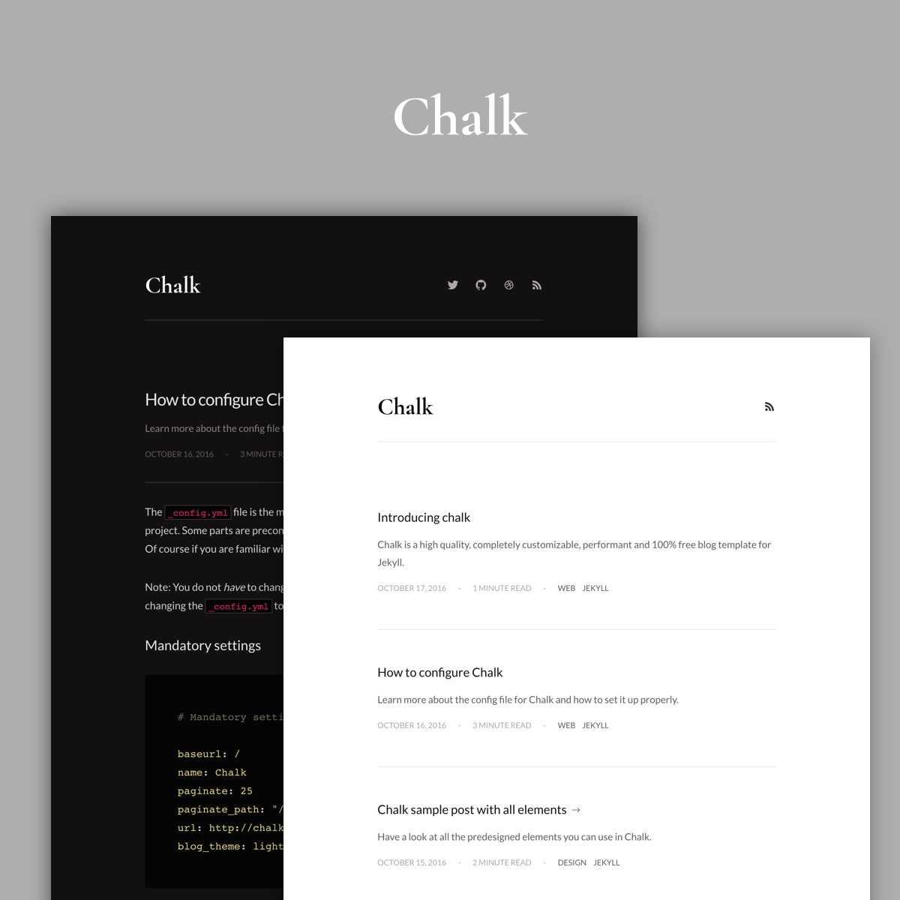

# Chalk Theme




## Description
The **Chalk** Theme is for [Grav CMS](http://github.com/getgrav/grav).  
It is a port of the popular Jekyll's chalk theme to Grav.

This repository is for the theme only, new user might preferably want to use the [skeleton](https://github.com/paulmassen/grav-skeleton-chalk) first as it ship with a few default page and configuration.

## Features
The **Chalk** Theme is available in a light mode and a dark mode. You can switch between the two designs through the Theme settings.

The theme requires the installation of several plugin:
- The reading time plugin, in order to display an estimation of reading time on articles.
- The highlight plugin, to format the code nicely
- The taxonomylist plugin, used in the page that display a list of tags
- The quick-tray-links plugin, used to quickly have access to the theme settings thanks to a gear icon in the sidebar.
- Optional: the JSComments plugin. Once enabled, the comment section will appear on every blog post.

As this theme is minimal, only a few templates are available:
- Default template: (`default.html.twig`) is used to simply display a page of text
- Blog Listing template: (`blog_listing.html.twig`) is used to display articles as set in the page collection.
- Post template: (`post.html.twig`) the post itself
- Tags template: (`tags.html.twig`) this template is used to display a list of tags gathered across the articles, as shown in the demo.

Every page added will be added to the navigation, but keep in mind that the theme is designed for websites with only a few pages (eg: Blog, About, Tags), adding more page might cause a bug in the display of the nav bar.


## Todo

- [] Create a plugin for fluidbox: Theme comes with fluidbox, a medium-like image viewer. Markdown should be changed to look like this for it to work:
```
<a class="fluidbox-trigger" href="/grav/user/pages/07.blog/06.first-post/99.jpg">
{.fluidbox-trigger}
 </a>
```
 